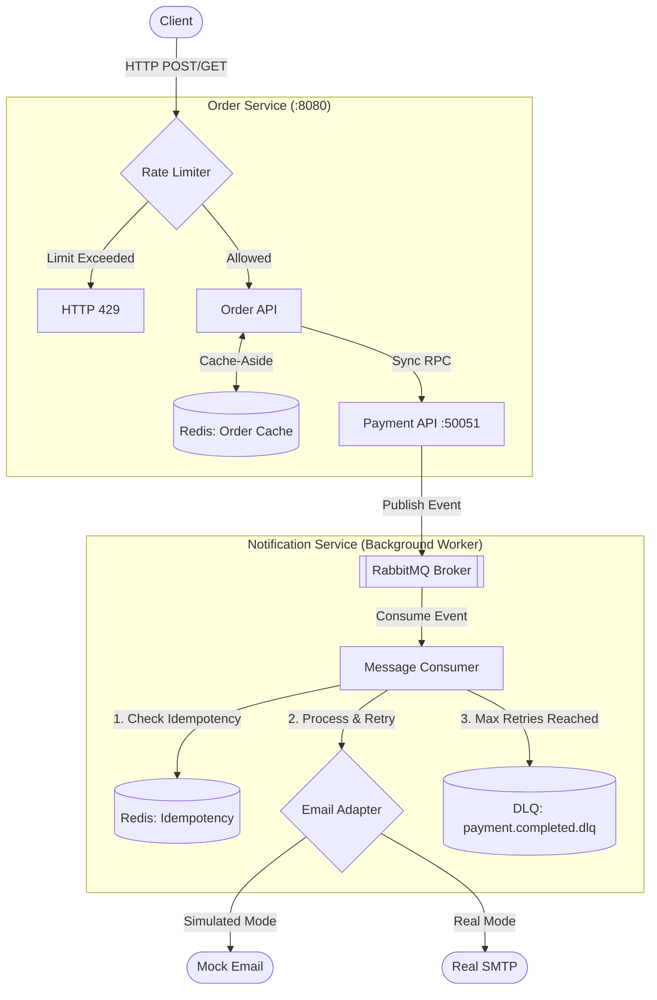

Assignment 4 — Performance Optimization & External Integrations
Overview
Assignment 4 adds caching, background workers, and external integrations to the microservices from Assignment 3.
Key additions:

Redis caching for orders (cache-aside pattern)
Background notification worker with retry logic
Adapter pattern for email providers
Rate limiting per client IP
Dead Letter Queue for failed messages

We Added
1. Redis Cache (25%)
Files: order-service/internal/cache/redis_cache.go
Stores order data in Redis for 5 minutes. When a client GETs an order:

First time: queries database (cache MISS), stores result in Redis
Next 5 minutes: returns from Redis (cache HIT) — no DB query

When order status changes (cancel, payment), the cache entry is deleted immediately to prevent stale data.
2. Background Worker with Exponential Backoff (25%)
Files: notification-service/internal/usecase/notifier.go
Processes payment events asynchronously. If the email provider fails:

Attempt 1: wait 2s → retry
Attempt 2: wait 4s → retry
Attempt 3: wait 8s → retry
If still fails: mark as "failed" and continue (don't block order creation)

3. Adapter Pattern for Providers (20%)
Files:

notification-service/internal/provider/provider.go (interface)
notification-service/internal/provider/simulated.go (implementation)

Email sending is abstracted behind an EmailSender interface. Two implementations:

SIMULATED: 30% failure rate (tests retry logic)
REAL: 10% failure rate (more stable)

Selected via PROVIDER_MODE environment variable. Adding new providers (Mailjet, SendGrid) requires no changes to notifier code.
4. Redis Idempotency for Jobs (20%)
Files: notification-service/internal/usecase/notifier.go
Tracks processed events in Redis with key notification:processed:<event_id>. If the same event is requeued:

Check Redis → found → skip (already sent)
Check Redis → not found → send and mark

Persists across service restarts (unlike old in-memory map).
5. Rate Limiter (Bonus +10%)
Files: order-service/internal/transport/http/middleware/rate_limiter.go
Limits each client IP to 10 requests per minute using Redis counters. After 10 requests, returns HTTP 429 with Retry-After header.
6. Dead Letter Queue / DLQ (Bonus +10%)
Files: notification-service/internal/consumer/rabbitmq_consumer.go
Messages that fail permanently (detected by amount=13 for testing) are retried 3 times, then sent to RabbitMQ Dead Letter Queue for manual inspection.

Architecture



## 🚀 How to Test

### 1. Cache-Aside Test
Create an order, copy its ID, and fetch it.
```bash
# Create an order
curl -X POST http://localhost:8080/orders \
  -H "Content-Type: application/json" \
  -H "Idempotency-Key: test-001" \
  -d '{"customer_id":"cust1","item_name":"Laptop","amount":9999}'

# Save the order ID from response, then GET
curl http://localhost:8080/orders/<id>

# Check logs - first GET shows MISS, second shows HIT
docker logs ap2_assignment1-order-service-1 | Select-Object -Last 5
```

### 2. Exponential Backoff Test
Trigger an order and watch the retry delays.
```bash
# Watch logs
docker logs ap2_assignment1-notification-service-1 -f

# In another terminal, create an order
curl -X POST http://localhost:8080/orders \
  -H "Content-Type: application/json" \
  -H "Idempotency-Key: test-002" \
  -d '{"customer_id":"cust1","item_name":"Phone","amount":5000}'
```
*Logs will show retries with delays: 2s, 4s, 8s (if provider fails).*

### 3. Rate Limiter Test
Send 11 requests rapidly.
```powershell
for ($i = 1; $i -le 11; $i++) {
    curl -X POST http://localhost:8080/orders `
      -H "Content-Type: application/json" `
      -H "Idempotency-Key: rate-$i" `
      -d '{"customer_id":"cust1","item_name":"Test","amount":100}' 2>&1 | Select-String "201|429"
}
```
*First 10 requests: 201 Created. Request 11: 429 Too Many Requests.*

### 4. DLQ / Poison Message Test
Send order with amount=13 (special poison value).
```bash
curl -X POST http://localhost:8080/orders \
  -H "Content-Type: application/json" \
  -H "Idempotency-Key: poison-001" \
  -d '{"customer_id":"cust1","item_name":"Poison","amount":13}'

# Watch logs - will show 3 DLQ retries then move to DLQ
docker logs ap2_assignment1-notification-service-1 | Select-Object -Last 10
```
*Check RabbitMQ UI: `http://localhost:15672` (admin/admin123). Queues → `payment.completed.dlq` → should show 1 message.*