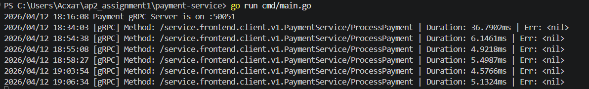
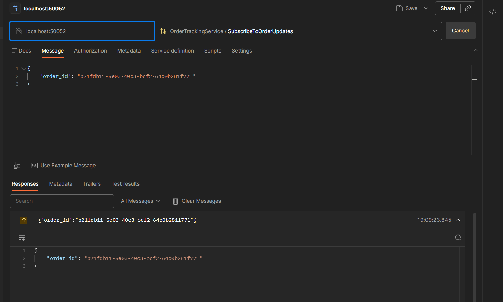

# Order & Payment Microservices System (gRPC Assignment)
This project implements a microservices architecture using Go, gRPC, and REST (Gin). The system consists of an Order Service and a Payment Service communicating over gRPC, with an automated Contract-First workflow.

# 🛠 Project Structure & Repositories
Following the Contract-First principle, the project is split into separate repositories:

Repository A (Protos): https://github.com/Askhat111/protos-repository

Contains only .proto definitions for the services.

Repository B (Generated): git clone https://github.com/Askhat111/converted-proto.git

GitHub Actions automatically compiles .proto files into .pb.go code and pushes them here.

Order Service: Current repository (gRPC Server/Client & REST).

Payment Service: Current repository (gRPC Server).

# 📋 Features Implemented
1. Contract-First Flow (30%)
Automated remote code generation via GitHub Actions.

Centralized dependency management using a shared generated repository.

2. gRPC Migration & Configuration (30%)
Order Service (Client): Internal calls to Payment Service use gRPC instead of traditional HTTP.

Payment Service (Server): Implements the ProcessPayment RPC.

Environment Variables: No hardcoded IPs or Ports. Configured via DATABASE_URL, GRPC_PORT, and PAYMENT_SERVICE_ADDR.

3. Order Tracking - Server-side Streaming (15%)
Endpoint: rpc SubscribeToOrderUpdates(OrderRequest) returns (stream OrderStatusUpdate).

Real-time Logic: The stream is tied to the PostgreSQL database. When a status changes, the update is pushed to the client immediately via Go Channels.

4. gRPC Interceptor (Bonus +10%)
Implemented a Unary Interceptor in the Payment Service.

Logs every incoming request: Method Name, Duration, and Status.

# How to Run
Prerequisites
Docker & Docker Compose (for PostgreSQL)

Go 1.21+

1. Setup Databases
Run the containers for both service databases:

Bash
docker-compose up -d
2. Run Payment Service
Bash
cd payment-service
go run cmd/main.go
3. Run Order Service
Bash
cd order-service
go run cmd/main.go
🧪 Testing
Create an Order (REST)
URL: POST http://localhost:8080/orders
Body:

JSON
{
  "customer_id": "Askhat",
  "item_name": "Laptop",
  "amount": 50000
}
Subscribe to Updates (gRPC Stream)
Open Postman and create a gRPC Request.

Connect to localhost:50052.

Invoke SubscribeToOrderUpdates with the order_id received from the REST response.

We will see real-time status updates as the order moves from Pending to Paid.

# Evidence
gRPC Logging: Console logs show [gRPC] Method: 


Streaming: Real-time JSON updates appear in the Postman gRPC window upon order creation.


# Architecture Diagram
The following diagram illustrates the communication flow between the services:

Client sends an HTTP POST request to the Order Service (Port 8080).

Order Service creates a record in the Order DB and calls the Payment Service via gRPC (Port 50051).

Payment Service processes the transaction and returns a response.

Order Service updates the status in the DB and broadcasts the change via gRPC Server-side Streaming (Port 50052) to all subscribed clients.

```mermaid
graph TD
    Client[Client / Postman] -->|HTTP POST :8080| OrderService[Order Service]
    Client -->|gRPC Stream :50052| OrderService
    OrderService -->|gRPC Unary :50051| PaymentService[Payment Service]
    
    subgraph Databases
        OrderService --- ODB[(Order DB)]
        PaymentService --- PDB[(Payment DB)]
    end

    subgraph Contracts
        ProtoRepo[Protos Repository] -->|GitHub Actions| GenRepo[Generated Code Repo]
        GenRepo -->|go get| OrderService
        GenRepo -->|go get| PaymentService
    end
    ```